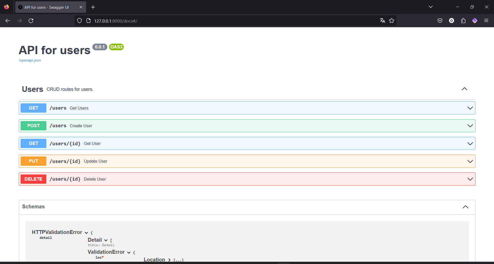
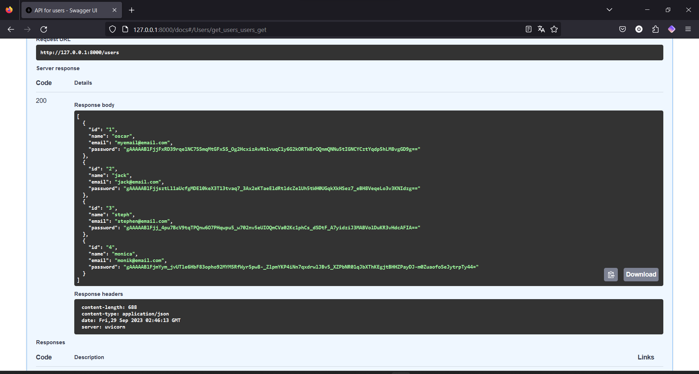

# CRUD example with FastAPI

 

FastAPI is a web development framework for Python that makes it easy to create web APIs quickly and efficiently. 
One of the standout features of FastAPI is its ability to automatically generate interactive documentation for the APIs you build. 
This documentation is based on the annotations you add to your code and can be viewed in a web browser.

 

In this example, we've implemented a CRUD (Create, Read, Update, Delete) for users, and as you can see in the interactive documentation, we can seamlessly interact with our API directly from the browser without any issues.

In summary, FastAPI greatly simplifies the generation of documentation for your APIs by automatically extracting information from type annotations and descriptions you provide in your code. This interactive documentation makes it easier for developers to understand and use your API, enhancing its usability and the adoption of your web service.

 

## Contact me
If you have any comments, please do not hesitate to contact me:
- **Website:** [www.ozkar.codes](https://www.ozkar.codes/)
- **Email:** ozkarhdz@skiff.com
- **Twitter:** [@OzkarHdz_](https://twitter.com/OzkarHdz_)
- **Mastodon:** [sivar.cafe/ozkarhdz](https://sivar.cafe/@ozkarhdz)
